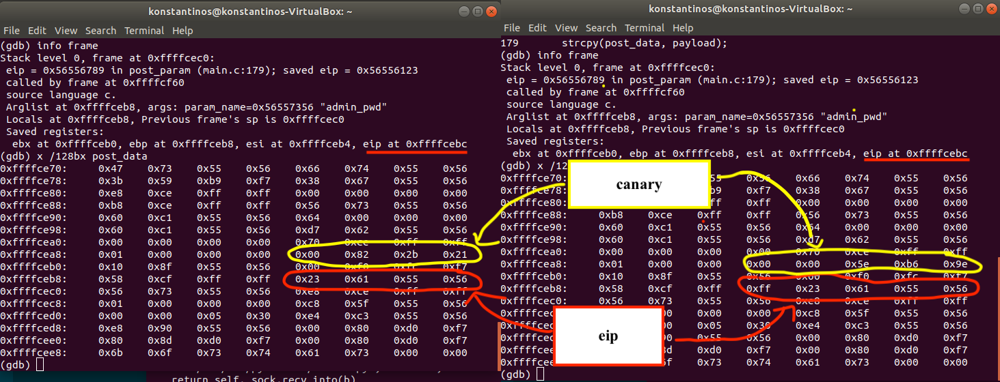
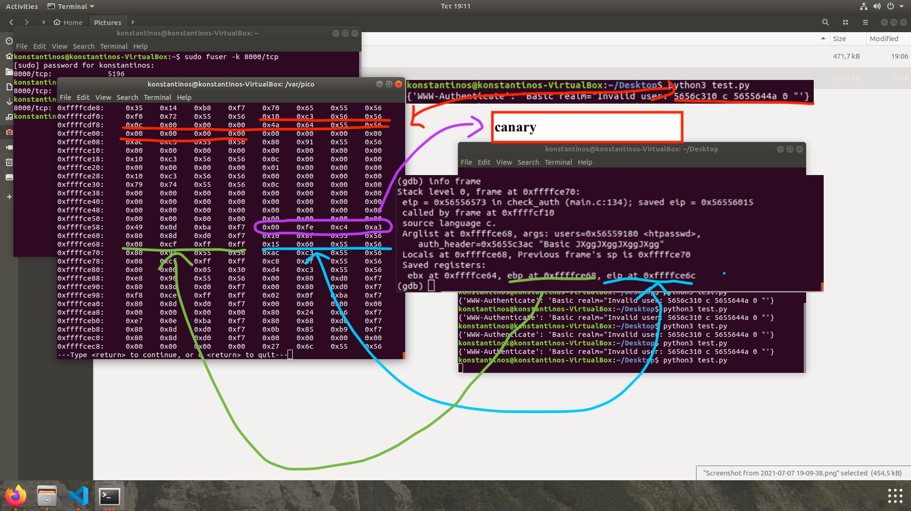
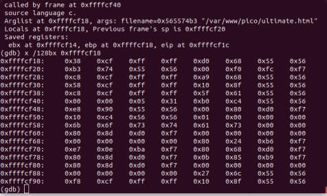
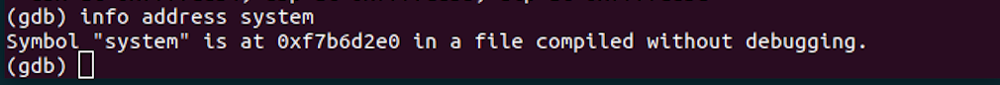
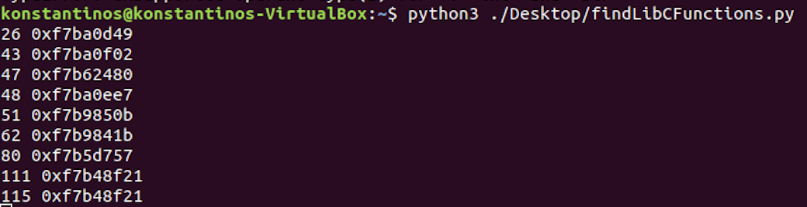

# Multi-Stage Cybersecurity Challenge

## Table of Contents
- [Challenge Overview](#challenge-overview)
- [Challenge Questions](#challenge-questions)
- [General Notes](#general-notes)
- [Stage 1: Locating George](#stage-1-locating-george)
  - [Objective](#objective-1)
  - [Methodology](#methodology-1)
  - [Tools Used](#tools-used-1)
  - [Results](#results-1)
- [Stage 2: Identifying the Perpetrator of the "Plan X" Theft](#stage-2-identifying-the-perpetrator-of-the-plan-x-theft)
  - [Objective](#objective-2)
  - [Methodology](#methodology-2)
  - [Tools Used](#tools-used-2)
  - [Results](#results-2)
- [Stage 3: Locating the "Plan X" Files](#stage-3-locating-the-plan-x-files)
  - [Objective](#objective-3)
  - [Methodology](#methodology-3)
  - [Tools Used](#tools-used-3)
  - [Results](#results-3)
- [Stage 4: Extracting the Results of "Plan Y"](#stage-4-extracting-the-results-of-plan-y)
  - [Objective](#objective-4)
  - [Methodology](#methodology-4)
  - [Tools Used](#tools-used-4)
  - [Results](#results-4)
- [Stage 5: Retrieving the Code for "Plan Z"](#stage-5-retrieving-the-code-for-plan-z)
  - [Objective](#objective-5)
  - [Methodology](#methodology-5)
  - [Tools Used](#tools-used-5)
  - [Results](#results-5)
- [Automation Script](#automation-script)
- [Conclusion](#conclusion)

---

## Challenge Overview
This project presents a five-stage cybersecurity challenge, designed as a progressive treasure hunt. Each stage requires the application of advanced security analysis, reverse engineering, cryptanalysis, and automation skills. The following report details the methodology, tools, and scripts used to solve each stage, providing a comprehensive technical walkthrough suitable for professional review.

---

## Challenge Questions
1. Where is George located?
2. Who stole the "Plan X" files?
3. Where are the "Plan X" files located?
4. What are the results of "Plan Y"?
5. What is the code for "Plan Z"?

---

## General Notes
- The project is structured for collaborative teams.
- All automation scripts are compatible with Ubuntu 20.04 and utilize standard, widely available software.
- A `run.sh` script is provided to execute the automation programs with the required parameters.
- This report documents each step taken, including scripts and code used, to ensure reproducibility and transparency.
- The complexity of the stages increases significantly as the challenge progresses.
- For incomplete stages, the report includes a description of progress and proposed next steps, with partial implementations where applicable.
- Timeliness and minimal reliance on hints are considered in the evaluation of solutions.
- Participants are advised to avoid spoilers and denial-of-service (DoS) attacks or excessive requests.

---

## Stage 1: Locating George
### Objective 1
Identify the location of George by investigating a series of hidden services and encrypted clues.

### Methodology 1
- The investigation began by visiting the .onion address provided in the challenge image.
- Using browser developer tools, a comment was discovered containing a link to a Medium article on securing .onion sites: https://blog.0day.rocks/securing-a-web-hidden-service-89d935ba1c1d
- Section 3.1 of the article referenced `server-status` and `server-info` endpoints. While `server-status` was inaccessible, `server-info` was available.
- The `server-info` endpoint revealed a secondary onion domain: `http://flffeyo7q6zllfse2sgwh7i5b5apn73g6upedyihqvaarhq5wrkkn7ad.onion/`, and indicated that directory listing was enabled.
- Accessing this domain, it was observed that `access.php` was invoked. Investigation of accessible files led to `robots.txt`, which disallowed `.phps` files.
- By accessing `access.phps`, the source code for `access.php` was obtained.
- The script [sevens.py](./scripts/sevens.py) was used to identify the required value for the `desired` parameter.
- A vulnerability in the `strcmp` function allowed authentication bypass by submitting an empty array as the password, e.g., `http://flffeyo7q6zllfse2sgwh7i5b5apn73g6upedyihqvaarhq5wrkkn7ad.onion/access.php/?user=0001337&password[]` (the user ID padded to 7 digits).
- This granted access to a blog at `http://flffeyo7q6zllfse2sgwh7i5b5apn73g6upedyihqvaarhq5wrkkn7ad.onion/blogposts7589109238/`. Navigating to the diary entry and leveraging directory listing, a previously unseen post (`post3.html`) was found, referencing visitor #834472 on the fixers' site.
- Reloading the fixers' site revealed a visitor number of 204, which was determined to be set via a cookie: `MjA0OmZjNTZkYmM2ZDQ2NTJiMzE1Yjg2YjcxYzhkNjg4YzFjY2RlYTljNWYxZmQwNzc2M2QyNjU5ZmRlMmUyZmM0OWE`.
- Decoding the cookie with base64 yielded `204:fc56dbc6d4652b315b86b71c8d688c1ccdea9c5f1fd07763d2659fde2e2fc49a`. Analysis of the `pico` source code revealed that authentication used `base64(username:sha256(password))`. By hypothesizing the password as `834472`, the correct value was constructed: `ODM0NDcyOjI3YzNhZjdlZjJiZWUxYWY1MjdkYmY4YzA1YjNkYjZjY2E2MzU4OTk0MWI4ZDQ5NTcyYWE2NGI1Y2Q4YzViOTc=`.
- Setting the new cookie produced the message: `Congrats user #834472!! Check directory /sekritbackup1843 for latest news...`
- At `http://2bx6yarg76ryzjdpegl5l76skdlb4vvxwjxpipq4nhz3xnjjh3jo6qyd.onion/sekritbackup1843/`, two GPG files and `notes.txt` were found. The notes described the GPG key derivation process and referenced a transaction hash on the Ropsten testnet.
- Searching the transaction hash on Etherscan (https://ropsten.etherscan.io/tx/0xdcf1bfb1207e9b22c77de191570d46617fe4cdf4dbc195ade273485dddc16783) revealed the string `bigtent` in the input data. The script [decodeGpgFiles.py](./scripts/decodeGpgFiles.py) was used to brute-force the GPG passphrase, successfully decrypting the files.
- The script [findTheLink.py](./scripts/findTheLink.py) was used to analyze `firefox.log`, revealing a repository. The commit hash from `signal.log` was located in this repository: https://github.com/asn-d6/tor/commit/4ec3bbea5172e13552d47ff95e02230e6dc99692.
- The commit contained RSA parameters (N, e). Using [script.py](./scripts/script.py), the encrypted values x and y were decrypted. The primes p and q were determined using WolframAlpha to solve `N = (p-1)(q-1)`.
- Finally, at `http://aqwlvm4ms72zriryeunpo3uk7myqjvatba4ikl3wy6etdrrblbezlfqd.onion/30637353063735.txt`, it was revealed that George is located at Kilimanjaro.

### Tools Used 1
- Browser DevTools
- Python scripts: [sevens.py](./scripts/sevens.py), [decodeGpgFiles.py](./scripts/decodeGpgFiles.py), [findTheLink.py](./scripts/findTheLink.py), [script.py](./scripts/script.py)
- Online tools: Etherscan, WolframAlpha, md5.gromweb.com

### Results 1
George is located at Kilimanjaro.

---

## Stage 2: Identifying the Perpetrator of the "Plan X" Theft
### Objective 2
Determine who stole the "Plan X" files by analyzing a custom server and exploiting vulnerabilities.

### Methodology 2
- From the page [blogposts7589109238/blogposts/diary2.html](http://flffeyo7q6zllfse2sgwh7i5b5apn73g6upedyihqvaarhq5wrkkn7ad.onion/blogposts7589109238/blogposts/diary2.html), it was determined that the Plan X server is at `zwt6vcp6d5tao7tbe3je6a2q4pwdfqli62ekuhjo55c7pqlet3brutqd.onion`, and its source code is available at [chatziko/pico](https://github.com/chatziko/pico).
- In [main.c](https://github.com/chatziko/pico/blob/master/main.c), a comment indicated a warning related to `printf(auth_username)` (line 135), which was confirmed by compiling and running the server locally.
- The code exhibited an uncontrolled format string vulnerability, as `printf` was called without a format specifier, allowing for stack data leakage.
- By submitting a username containing format specifiers (e.g., `%x %x %x %x %x %x %s`), the first entry of the `htpasswd` array was printed, revealing the admin's username and hashed password: `admin:e5614e27f3c21283ad532a1d23b9e29d`.
- The hash was reversed using [md5.gromweb.com](https://md5.gromweb.com/?md5=e5614e27f3c21283ad532a1d23b9e29d), yielding the password `bob's your uncle`.
- With these credentials, access was gained to `http://zwt6vcp6d5tao7tbe3je6a2q4pwdfqli62ekuhjo55c7pqlet3brutqd.onion/`, where it was discovered that the "Plan X" files were stolen by the group "5l0ppy 8uff00n5".

### Tools Used 2
- Source code review
- Online hash reversal tools

### Results 2
The "Plan X" files were stolen by the group "5l0ppy 8uff00n5".

---

## Stage 3: Locating the "Plan X" Files
### Objective 3
Locate the stolen "Plan X" files by exploiting buffer overflow vulnerabilities and leaking stack information.

### Methodology 3
- In-depth analysis of the `pico` source code revealed that the `serve_ultimate()` function is invoked upon successful authentication in `post_param()`.
- The POST request to `/ultimate.html` included data in the form `admin=<given pass>&submit=go`. The payload was stored using `strcpy` into `post_data`, with the buffer size determined by `payload_size+1`.
- If the request included a `Content-Length` header, `payload_size` was set to that value, not the actual payload size. This allowed for a buffer overflow by setting `Content-Length` less than the actual payload size.
- Using GDB, the stack layout was analyzed to determine the positions of the canary, return address, and the offset between `post_data` and the canary. The canary was located 15 bytes after `post_data`. The payload structure was determined as:

      payload = 15 * post_data + canary + 3 * post_data + serve_ultimate address

- Filler values were used to avoid crashes due to overwritten variables. `Content-Length` was set to zero to bypass the loop processing name-value pairs.
- The canary's null byte could not be set directly, so the `&` character was used, which would be converted to null during processing.
- To obtain the canary and relevant addresses on the target system, the format string vulnerability in `check_auth` was exploited. By submitting a username with 27 `%x` specifiers, the canary value was leaked. Additional specifiers allowed for extraction of stack and instruction addresses, enabling calculation of the required offsets for the exploit payload.
- By matching the values leaked by printf with the stack layout in GDB, the offsets for the canary, stack, and instruction addresses were determined. This allowed calculation of the address of `post_data` and `serve_ultimate` on the target system.

#### Stack Analysis

#### Printf Stack Leak

### Tools Used 3
- GDB
- Python scripting
- Custom exploit payloads

### Results 3
Successfully exploited the buffer overflow and format string vulnerabilities to leak stack information and prepare for further exploitation.

---

## Stage 4: Extracting the Results of "Plan Y"
### Objective 4
Extract the results of "Plan Y" by leveraging file retrieval vulnerabilities.

### Methodology 4
- The `send_file` function in `pico` was identified as a means to retrieve arbitrary files, such as `var/backup/backup.log`.
- The exploit payload was modified to use the address of `send_file` instead of `serve_ultimate`, and the desired filename was placed in `post_data`.
- By aligning the stack and overwriting the filename pointer to reference `post_data`, the contents of `backup.log` and subsequently `z.log` were retrieved, providing the solution for this stage.
- In GDB, it was observed that the `ebp` is 16 bytes after the `eip` of `post_param`. To ensure the filename pointer is correct, four times the address of `post_data` was appended after the address of `send_file` in the payload.

      payload = (file_name_aligned) + (15 - (file_name_aligned/4)) *  post_data + canary + 3 * post_data + send_file address + 4 * post_data

#### Send File Exploit

### Tools Used 4
- GDB
- Custom exploit payloads

### Results 4
Successfully retrieved the contents of backup.log and z.log, extracting the required results for "Plan Y".

---

## Stage 5: Retrieving the Code for "Plan Z"
### Objective 5
Retrieve the code for "Plan Z" by solving a chess puzzle and executing a return-to-libc attack.

### Methodology 5
- The following sequence was identified as chess moves:

      1.e4 c6 2.d4 d5 3.Nc3 dxe4 4.Nxe4 Nd7 5.Ng5 Ngf6 6.Bd3 e6 7.N1f3 h6 8.Nxe6 Qe7 9.0-0 fxe6 10.Bg6+ Kd8 11.Bf4 b5 12.a4 Bb7 13.Re1 Nd5 14.Bg3 Kc8 15.axb5 cxb5 16.Qd3 Bc6 17.Bf5 exf5 18.Rxe7 Bxe7

- Using a chess analysis tool, the optimal next move was determined to be `c4`.

- To obtain the IP address, a shell command was required. Initial attempts using `exec` were unsuccessful. After consulting relevant literature ([return-to-libc.pdf](https://css.csail.mit.edu/6.858/2011/readings/return-to-libc.pdf)), a return-to-libc attack leveraging the `system` function was implemented.
- The address of `system` was determined by analyzing the offsets between libc functions, using the format string vulnerability to leak addresses from the stack. The script [find_libc_function.py](./scripts/find_libc_function.py) automated this process. The script checked all values popped by printf from positions 1 to 1000, and if they matched the prefix of the system address, it printed the position and value.

#### Libc System Address

#### Libc Function Scan Script

- The final payload structure was:

      payload = 15 * post_data + canary + 3 * post_data + system_address + post_data + argument_address

- The argument, `dig +short myip.opendns.com @resolver1.opendns.com`, was appended after the payload, with `argument_address` pointing to its location.
- Executing the exploit revealed the IP address `54.159.81.179`, resulting in the final answer: `c454.159.81.179`.

### Tools Used 5
- Chess analysis tool
- GDB
- Python scripting: [find_libc_function.py](./scripts/find_libc_function.py)

### Results 5
Successfully solved the chess puzzle and executed a return-to-libc attack to retrieve the code for "Plan Z".

---

## Automation Script
### Usage
- The [run.sh](./scripts/run.sh) script initializes Tor (port 9050) and socat to forward connections to `zwt6vcp6d5tao7tbe3je6a2q4pwdfqli62ekuhjo55c7pqlet3brutqd.onion` (127.0.0.1:8000), then executes the Python script [attack_3_4_5.py](./scripts/attack_3_4_5.py).
- If execution fails, ensure the script has execute permissions. Two known failure cases are:
    - If any byte of the canary, post_data, or serve_ultimate_address is null (ValueError: embedded null byte)
    - If these values contain `"` or `` ` ``
- In such cases, retrying may resolve the issue as the values change.
- Each curl command is limited to a 3-second timeout for sequential execution; this can be adjusted by modifying the `--max-time` flag.

---

## Conclusion
This project demonstrates a comprehensive approach to multi-stage cybersecurity challenges, combining vulnerability analysis, cryptanalysis, reverse engineering, and automation. The methodologies and scripts provided can serve as a reference for similar security assessments and CTF-style competitions.

Thank you for reviewing this project.
